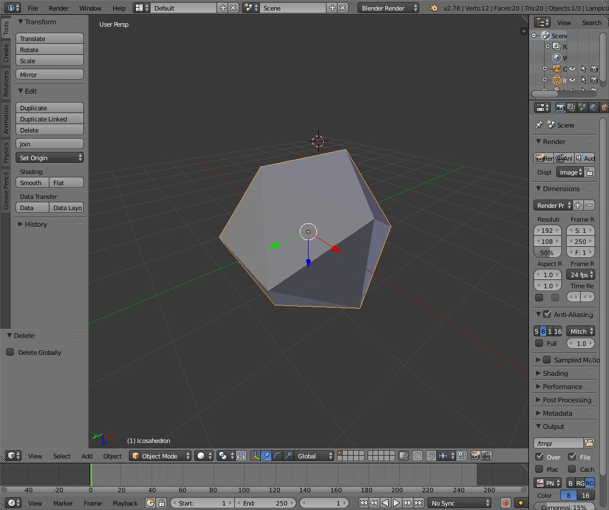
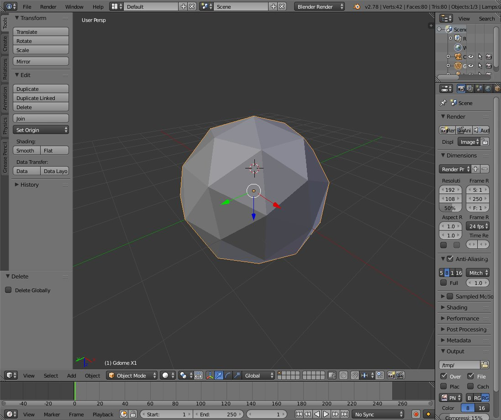
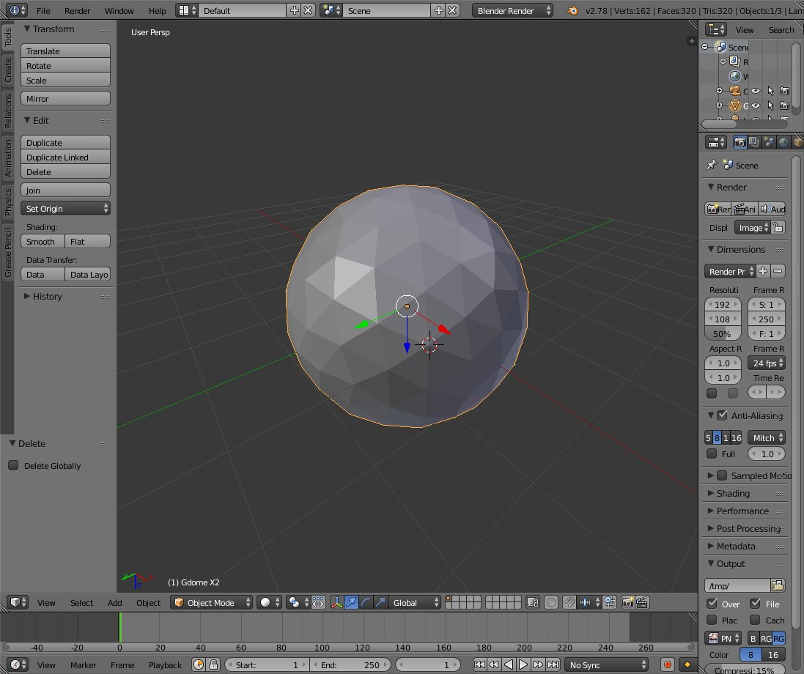
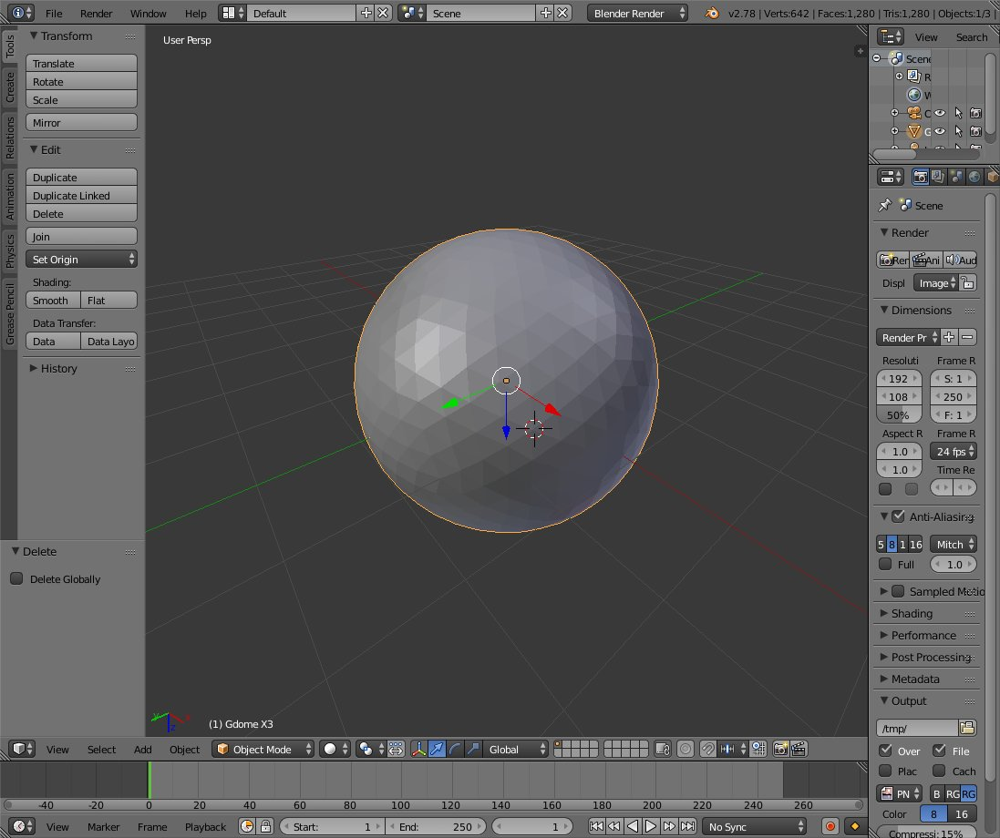

# 測地ドーム

Richard Buckminster Fullerによって考案された幾何学形状[1]．
球面を均質に細分化する多面体．

## 正二十面体

ここでは正二十面体を用いて作成することを考えるため，
まず正二十面体を作る．
正二十面体の作成は[2]を参考にしている．

## 各辺の分割と頂点の生成

正二十面体のすべての辺に対して分割を行い，
球の中心からの半径が変わらないように新たな頂点を生成する．

## 面の分割

分割前の面を構成する辺から生成された頂点を使って
面を４つに分割する．

## 再帰分割による面の増殖

新たに生成された多面体に対し，
辺の分割，頂点の生成，面の分割を再帰して適用することで
より球体に近い多面体を生成することができる．

## 分割による性質

\({^m n _f}, {^m n _ e}, {^m n _v}\)を
それぞれm回分割後の面，辺，頂点の数とする．
それぞれの初期値(正二十面体)は
\({^0 n _f} = 20, {^0 n _e} = 30, {^0 n _v} = 12\)である．

分割の回数とそれぞれの増加量は以下のように求められる．

\[
\begin{align*}
{^{k+1} n _f} &= {^k n _f} \times 4\\
{^{k+1} n _e} &= {^k n _e} \times 2 + {^k n _f} \times 3\\
{^{k+1} n _v} &= {^k n _v} + {^k n _e}
\end{align*}
\]

## 分割結果

### 分割回数0(正二十面体)

### 分割回数1

### 分割回数2

### 分割回数3

## 参考文献

- [1] Fuller, Richard Buckminster. Building construction, US 2682235 A, 1954
- [2] 正多面体
    - [http://www.h6.dion.ne.jp/~ooya/Suugaku/Seitamentai.pdf](http://www.h6.dion.ne.jp/~ooya/Suugaku/Seitamentai.pdf)
